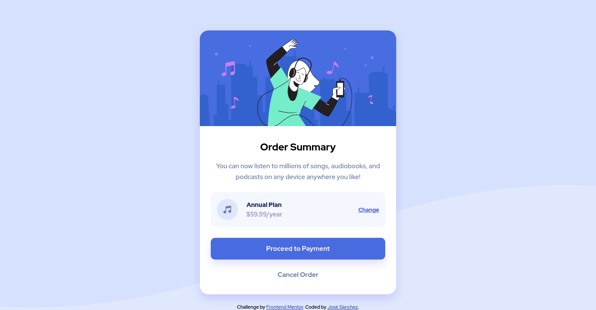

# Frontend Mentor - Order summary card solution

This is a solution to the [Order summary card challenge on Frontend Mentor](https://www.frontendmentor.io/challenges/order-summary-component-QlPmajDUj). Frontend Mentor challenges help you improve your coding skills by building realistic projects. 

## Table of contents

- [Overview](#overview)
  - [The challenge](#the-challenge)
  - [Screenshot](#screenshot)
  - [Links](#links)
- [My process](#my-process)
  - [Built with](#built-with)
  - [What I learned](#what-i-learned)
  - [Continued development](#continued-development)
  - [Useful resources](#useful-resources)
- [Author](#author)
- [Acknowledgments](#acknowledgments)


## Overview

### The challenge

Users should be able to:

- See hover states for interactive elements
- Set background-images in the body
- There where many more things to change in the @media-query section, compared with the last challenge.

### Screenshot




### Links

- Solution URL: [Github](https://github.com/jhsanchezm/Frontend-Mentor-Challenge/tree/main/order-summary-component-main)
- Live Site URL: [Webpage](https://jhsanchezm.github.io/Frontend-Mentor-Challenge/order-summary-component-main/index.html)

## My process

### Built with

- Semantic HTML5 markup
- CSS custom properties
- Flexbox
- Mobile-first workflow
- Background-images in the body


### What I learned

The main thing that I've learned with this challenges are the background-image options in the body.


```css
body {
  background-image: url("./images/pattern-background-mobile.svg");
  background-repeat: no-repeat;
  background-size: 100%;
  background-color: var(--pale-blue);
  background-position: top;
}
```

### Continued development

Just need to put in practice more challenges to be sure from repetition of CSS properties.

### Useful resources

- [MRZ.Code.Manufacture - YouTube Video](https://www.youtube.com/watch?v=gpOxFTRhXE0) - This video helped me using the PureRef tool that supported me to measure the size of the elements depending on the screen size.


## Author

- Website - [José Sánchez](https://github.com/jhsanchezm)
- Frontend Mentor - [@jhsanchezm](https://www.frontendmentor.io/profile/jhsanchezm)


## Acknowledgments

Thanks to the YouTube channel MRZ.code.Manufacture. Every time when I get stuck in this challenges, he always has a clever solution. And thanks to the Frontend Mentor community fot their help.
