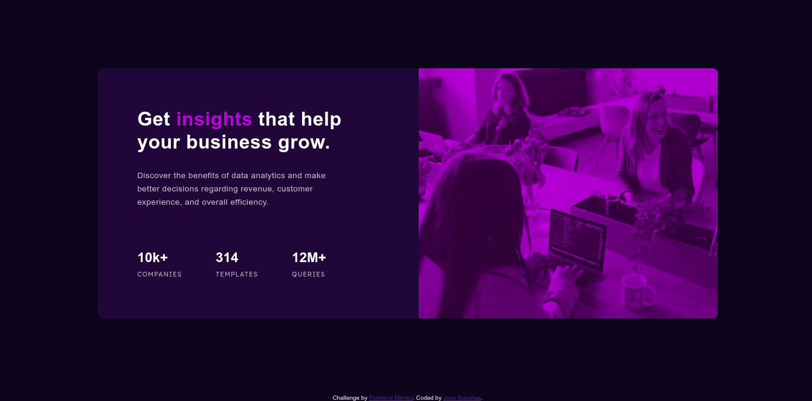

# Frontend Mentor - Stats preview card component solution

This is a solution to the [Stats preview card component challenge on Frontend Mentor](https://www.frontendmentor.io/challenges/stats-preview-card-component-8JqbgoU62). Frontend Mentor challenges help you improve your coding skills by building realistic projects. 

## Table of contents

- [Overview](#overview)
  - [The challenge](#the-challenge)
  - [Screenshot](#screenshot)
  - [Links](#links)
- [My process](#my-process)
  - [Built with](#built-with)
  - [What I learned](#what-i-learned)
  - [Continued development](#continued-development)
  - [Useful resources](#useful-resources)
- [Author](#author)
- [Acknowledgments](#acknowledgments)

## Overview

### The challenge

Users should be able to:

- View the optimal layout depending on their device's screen size

### Screenshot

### Links

- Solution URL: [Github](https://github.com/jhsanchezm/Frontend-Mentor-Challenge/tree/main/stats-preview-card-component-main)
- Live Site URL: [Live](https://jhsanchezm.github.io/Frontend-Mentor-Challenge/stats-preview-card-component-main/index.html)

## My process

First I worked in the general things of the card specially the text. Next to this I had to work with the image and all his components and at the end I used the @media to change the layout component when the screen size changes.

### Built with

- Semantic HTML5 markup
- CSS custom properties
- Flexbox

### What I learned

To put a layer over an image with the pink element

### Continued development

I expect to advance in the next Frontend Mentor challenge

### Useful resources

- [MRZ.Code.Manufacture](https://www.youtube.com/watch?v=zaHdmJf_ld4&t=1600s) - Every time I got stuck I saw the video to see how he solved it.

## Author

- Github - [jhsanchezm](https://github.com/jhsanchezm)
- Frontend Mentor - [@jhsanchezm](https://www.frontendmentor.io/profile/jhsanchezm)
- Twitter - [@yourusername](https://www.twitter.com/yourusername)

## Acknowledgments

I want to thank to MRZ.Code.Manufacture, that with his helping tutorial made easier to overcome the challenge, and I always learn a lot from him.
